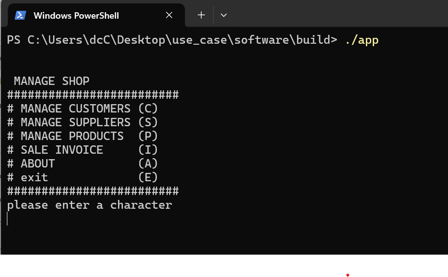
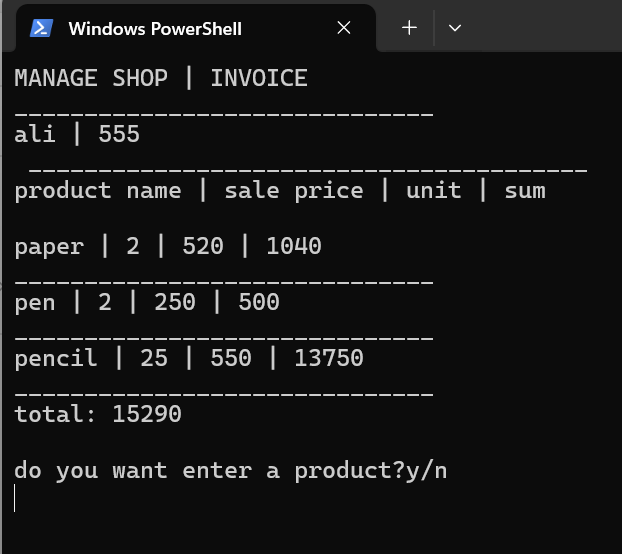

MANAGE SHOP

[](version)
[](license)

MANAGE SHOP is a software that writen in C language. whit this software you can easily manage a shop. you can enter customers, suppliers, products and give an invoice to a customer.

---

## 📋 Table of Contents
- [Features](#-features)
- [Installation](#-installation)
- [Screenshots](#-screenshots)
- [Changelog](#-changelog)
- [Contributing](#-contributing)
- [License](#-license)
- [Contact](#-contact)

---

## ✨ Features

- 🚀 **speed** - the software writen in c can easily run and work
- ⚡ **manage** - enter, edit and view customers, products and suppliers
- 📊 **invoice** - produce an invoice 


---

## 📦 Installation

### Prerequisites
- a c ompiler
- make

### Step-by-step Guide

```bash
# Clone the repository
git clone https://github.com/alishadan84/manageshop.git

# Navigate to the project directory
cd manageshop

# Run make
make

# Run the program
./build/app
```
---
### 📸 Screenshots

Figure 1: Main application window


*Figure 2: invoice view*

---
### 📝 Changelog
v1.0.0 (2026-07-06)
🎉 Initial release
Basic functionality implemented

---
### 🤝 Contributing
We welcome contributions! Please follow these steps:
1. Fork the repository
2. Create a branch: git checkout -b feature/amazing-feature
3. Commit changes: git commit -m 'Add amazing feature'
4. Push to branch: git push origin feature/amazing-feature
5. Open a Pull Request

### 📄 License
This project is licensed under the MIT License - see the LICENSE file for details.

### 📧 Contact
📧 Email: alishadan84@gmail.com
💼 LinkedIn: ali-shadan-48359152/